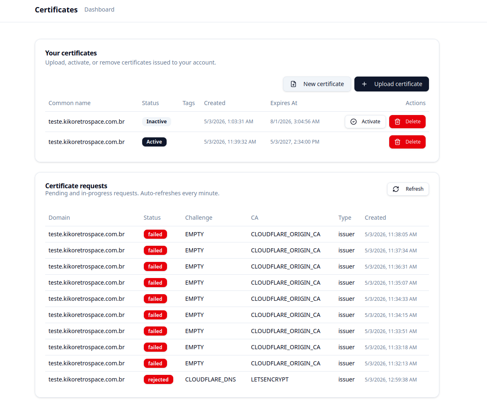

# CertBuddy

A comprehensive certificate management platform that automates the process of requesting, issuing, and renewing SSL/TLS certificates from multiple Certificate Authorities.



## Project Overview

CertBuddy is a full-stack application designed to simplify SSL/TLS certificate management for multiple domains. It provides an intuitive interface to request certificates from different Certificate Authorities, manage configurations, and automatically handle certificate renewals through scheduled tasks.

The system is built with:
- **Frontend**: React + TypeScript with Vite
- **Backend**: Python Flask API
- **Data Backend**: Directus (headless CMS)
- **Database**: Full high-end database with PostgresSQL 
- **Integration**: Allow Third-party integration with the Engine API
---

## Architecture

### Dashboard

- **Per user management**: Support the certificates storage and configuration management per user.
- **Certificate Management**: Request new certificates, manually upload certificates, activate or deactivated a certificate and manage the certificates.
- **Configuration Management**: Manage Certificate Authority accounts and challenge configurations, support shared configurations that can be merged into a specific configuration. 
- **Dashboard**: Overview of certificate status and system health

**Key Features**:
- Real-time certificate request tracking
- Configuration editor with validation
- Simple frontend to manage certificates with user own scope.

### Engine Backend
A Backend Engine construct in Python that can issue certificates and automatic renew certificates, supporting multi certificate authorities with multi challenge type, user can combine the certificate authority with a specific challenge to issue a certificate.

- **RESTful API**: Endpoints for certificates, configurations, and tasks management.
- **Certificate Issuance**: Orchestrates certificate requests through different CAs with diferrent validation challenges.
- **Task Scheduling**: Automated renewal checks and certificate lifecycle management
- **CORS Enabled**: Supports frontend communication from any origin
- **Swagger Documentation**: Built-in API documentation via Flasgger


### Data Backend (Directus)

Directus serves as the central data repository for CertBuddy, stores the certificates, manages CAs accounts and users.

- **Collections**: Stores certificates, certificate requests, configurations, accounts, and users
- **Authentication**: Master token authentication for backend operations
- **Extensibility**: Flexible schema for custom fields and relationships

---

## Certificate Authorities (CAs)

CertBuddy currently supports the following Certificate Authorities:

### 1. Let's Encrypt

The most widely-used free Certificate Authority providing DV (Domain Validation) certificates.

- **Certificate Types**: Wildcard and domain-specific certificates
- **Validation**: Supports DNS-01 challenges (working on the HTTP-01 flexible without reverse proxy needed)
- **Protocol**: ACME (Automated Certificate Management Environment) v2
- **Configuration**: Requires account credentials for certificate requests
- **Features**: Support for multiple accounts and flexible credential management

### 2. Cloudflare Origin CA

Cloudflare's private CA for issuing certificates to be used specifically with the Origin server behind the Cloudflare Cloud

- **Certificate Types**: Domain and wildcard certificates
- **Validation**: No challenge required (direct issuance for Cloudflare zones)
- **Configuration**: Requires Cloudflare API token
- **Features**: Fast certificate issuance without validation challenges

---

## Challenge Methods

CertBuddy supports various challenge types for domain validation:

### DNS-01 Challenge

A DNS-based validation method where a TXT record is placed in the domain's DNS configuration.

- **Cloudflare DNS Provider**: Automatically manages DNS records for Cloudflare-hosted zones
  - Requires Cloudflare API token
  - Dynamically discovers zone IDs
  - Automatic TXT record creation and cleanup
  - Multi-domain support via DNS wildcards

### No Challenge

For Certificate Authorities that don't require validation:

- Used by Cloudflare Origin CA
- Direct certificate issuance
- Suitable for internal or private zone certificates

### HTTP-01 Challenge (WIP)
Work in Progress, but will support accepting challenge by HTTP without need to acts as a reverse proxy..

---

## Tasks

CertBuddy includes an intelligent task scheduling system for automated certificate management:

### Renewal Task

Automatically renews certificates before they expire.

**Logic**:
- Runs on a configurable schedule
- Searches for active certificates expiring within 24 hours
- Retrieves the original certificate request configuration
- Initiates renewal through the appropriate Certificate Authority
- Updates certificate records with new expiration dates
- Maintains audit trail of all renewal operations
- Handles renewal failures with logging and alerts

**Benefits**:
- Prevents certificate expiration incidents
- Reduces manual monitoring overhead
- Ensures continuous service availability

### Task Scheduler

Manages all scheduled tasks in the system.

**Responsibilities**:
- Initializes configured tasks on startup
- Maintains task execution history
- Handles periodic task execution
- Provides task status monitoring
- Manages task lifecycle (start, stop, reschedule)

---

## Key Features

### Certificate Request Management
- Create new certificate requests with custom domain configurations
- Support for wildcard certificates
- Multi-domain SAN (Subject Alternative Name) support
- Track request status in real-time

### Configuration Management
- Store and manage CA credentials securely
- Configure challenge providers (DNS automation)
- Support for multiple CA accounts
- Flexible key-value configuration storage

### Automated Renewal
- Scheduled certificate renewal checks
- Automatic renewal 24 hours before expiration
- Configurable renewal task intervals
- Detailed renewal operation logs

### Certificate Lifecycle Tracking
- Issue date and expiration tracking
- Active/inactive status management
- Certificate history and audit trail
- Renewal status monitoring

---

## System Requirements

- Python 3.8+ (Backend)
- Node.js/Bun (Frontend)
- Directus instance (Data backend)
- Docker & Docker Compose (for containerized deployment)

## Getting Started

### Frontend Development
```bash
npm run dev
```

### Backend Development
```bash
source .venv/bin/activate
python backend/app.py
```

### Full Stack with Docker
```bash
docker-compose up
```

---

## Configuration

CertBuddy uses environment variables for configuration:

- `DIRECTUS_URL`: URL to the Directus instance
- `ENGINE_MASTER_TOKEN`: Authentication token for backend to Directus API
- `FLASK_ENV`: Environment mode (development/production)

Certificate Authority and challenge provider configurations are stored in Directus and can be managed through the application UI.

---

## API Documentation

The backend provides Swagger documentation accessible at `/apidocs` endpoint.

---

## License
MIT License

Copyright (c) 2206 Marcelo F. Andrade Junior (KIKO)

Permission is hereby granted, free of charge, to any person obtaining a copy
of this software and associated documentation files (the "Software"), to deal
in the Software without restriction, including without limitation the rights
to use, copy, modify, merge, publish, distribute, sublicense, and/or sell
copies of the Software, and to permit persons to whom the Software is
furnished to do so, subject to the following conditions:

The above copyright notice and this permission notice shall be included in all
copies or substantial portions of the Software.

THE SOFTWARE IS PROVIDED "AS IS", WITHOUT WARRANTY OF ANY KIND, EXPRESS OR
IMPLIED, INCLUDING BUT NOT LIMITED TO THE WARRANTIES OF MERCHANTABILITY,
FITNESS FOR A PARTICULAR PURPOSE AND NONINFRINGEMENT. IN NO EVENT SHALL THE
AUTHORS OR COPYRIGHT HOLDERS BE LIABLE FOR ANY CLAIM, DAMAGES OR OTHER
LIABILITY, WHETHER IN AN ACTION OF CONTRACT, TORT OR OTHERWISE, ARISING FROM,
OUT OF OR IN CONNECTION WITH THE SOFTWARE OR THE USE OR OTHER DEALINGS IN THE
SOFTWARE.